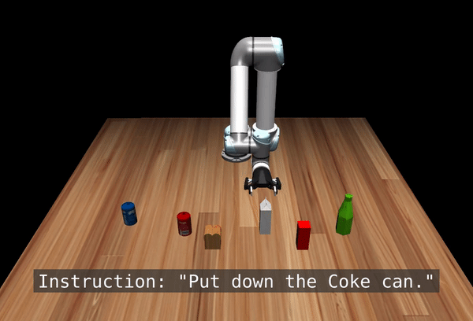
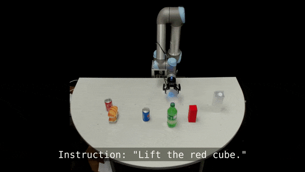
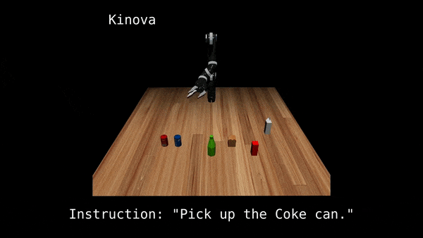
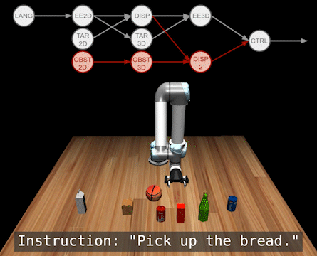
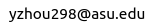

# ModAttn
Codebase for CoRL 2022 paper "[Modularity through Attention: Efficient Training and Transfer of Language-Conditioned Policies for Robot Manipulation](http://languageforrobots.com/)"

In this paper, we propose a sample-efficient approach for training language-conditioned manipulation policies that allows for rapid training and transfer across different types of robots. By introducing a novel method, namely Hierarchical Modularity, and adopting supervised attention across multiple sub-modules, we bridge the divide between modular and end-to-end learning and enable the reuse of functional building blocks.

The full experiments include the following steps:
- Data collection from the simulator
- Training the model
- Deploying the trained model back onto the simulator as an agent

This repo mainly aims at providing the code needed for step 2: training the model. Expert demonstrations are required to run this repo. After running this repo, you should expect to have a trained model which is ready to act as an agent.


# Already Supported Simulators v.s. Your Own Simulator
In this repo, we provide implementions of dataloaders and training scripts of the following 2 simulators. After you collect the dataset using the code provided in the simulators' repos, you are good to start the training using this repo.
### [Mujoco simulator with Panda, Kinova and UR5 robots](https://github.com/yfzhoucs/MujocoRobots)


### [TinyLanguageRobots 2D robot simulator for manipulation tasks](https://github.com/ir-lab/TinyLanguageRobots)


## Bring Your Own Simulator
It is also possible to plug in any of your own simulators. In such case, you just need to provide the following items to run the training:
- Your expert demonstrations
- Your own dataset class and dataloader
- Customization of the training script to import your own demos and dataloaders.

This repo mainly aims at providing the code needed for step 2: training the model. Expert demonstrations are required to run this repo. After running this repo, you should expect to have a trained model which is ready to act as an agent.


# Python Environment Setup

```
git clone https://github.com/ir-lab/ModAttn.git
pip install -r requirements.txt
```

# Training
There are main*.py files in the root folder, which are the scripts to start the training. Each main*.py file will import the model file and dataset file for the training. If you would like to use your own dataset, just import the dataset class to a main*.py file. The following are training scripts for the datasets of the 2 already supported simulators:
## Train the Mujoco robots
```
python main_mujoco_robot.py /path/to/train/set /path/to/val/set /path/to/ckpt/folder
```

## Train the TinyLangRobot robot
```
python main_tiny_lang_robot.py /path/to/train/set /path/to/val/set /path/to/ckpt/folder
```

# More Visualization of Results
## Sim2real Transfer


## Transfer across robots


## Obstacle Avoiding


## Inspection of network by visualizing the output of each sub-modules


# BibTeX
```
@inproceedings{
    zhou2022modularity,
    title={Modularity through Attention: Efficient Training and Transfer of Language-Conditioned Policies for Robot Manipulation},
    author={Yifan Zhou and Shubham Sonawani and Mariano Phielipp and Simon Stepputtis and Heni Ben Amor},
    booktitle={6th Annual Conference on Robot Learning},
    year={2022},
    url={https://openreview.net/forum?id=uCaNr6_dQB0}
}
```

# Contact
Feel free to contact us if you have any questions!

Yifan Zhou 